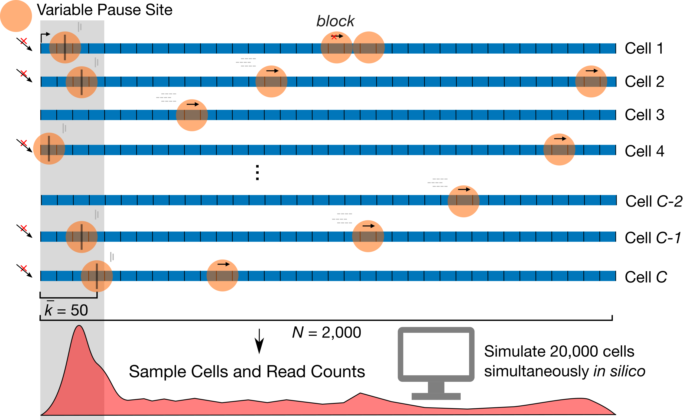

# SimPol — Simulating the dynamics of RNA Polymerase (RNAP) on DNA template

## Overview

SimPol tracks the independent movement of RNAPs along the DNA templates of a large
number of cells. It accepts several key
user-specified parameters, including the initiation rate, pause-escape rate,
a constant or variable elongation rate, the mean and variance of pause sites across cells,
as well as the center-to-center spacing constraint between RNAPs,
the number of cells being simulated, the gene length, and the total time of transcription.
The simulator simply allows each RNAP to move forward or not,
in time slices of $10^{-4}$ minutes, according to the specified position-specific
rate parameters. It assumes that at most one movement of each RNAP can occur per
time slice. The simulator monitors for collisions between adjacent RNAPs, prohibiting
one RNAP to advance if it is at the boundary of the allowable distance from the next.
After running for the specified time, SimPol outputs either a file in HDF5 format or files in CSV format that records all RNAP position for the last specified number of steps. See more options and details about parameters and outputs below.

<p align="center">
  
</p>

<p align = "center">
	Fig.1 Design of SimPol (“Simulator of Polymerases”)
</p>

## Option 1: Create Conda Environment

```
conda create -n simpol -c conda-forge -c anaconda

conda activate simpol

conda install -c conda-forge highfive
```

## Option 2: Use Singularity Environment


## Build

There is the option to build in either debug mode with debug symbols or release mode with compiler optimizations (e.g. -O2). 

To create a build directory in release mode

```
cmake -S . -B Release/ -D CMAKE_BUILD_TYPE=Release
```

To clean the release mode build directory

```
cmake --build Release/ --target clean
```

To build in release mode

```
cmake --build Release/
```

Note: Replace all instances of 'Release' with 'Debug' to build in Debug mode

## Run with UGE Workload Manager Example

```
qsub -pe OpenMP 5 -cwd -b y ./Release/simPol -n 100 --csv 10
```
* Note: This allocates 5 threads for the program in the OpenMP parallel environment

## Usage

```
Run in Release Mode: ./Release/simPol [options]
Simulate RNA polymerase dynamics with transcription parameters.

Run in Debug Mode: ./Debug/simPol [options]

Debug from command line: gdb ./Debug/simPol
	* Set breakpoint at line number: break 183
	* Run program with arguments: r -k 100
	* Print variable info at breakpoint: print k

Debug from vscode by setting up launch.json file and installing C/C++ extension

Run program with file containing command line arguments: ./Release/simPol $(<simPol_arguments.dat)

Pre-built debug and release executables can be found in the bin folder

	* ./bin/simPol_Debug

	* ./bin/simPol_Release

Set number of threads used in parallel environment:
	* On Cluster: Run qsub with -pe OpenMP <number of threads to use>
	* On Personal Machine: export OMP_NUM_THREADS=<number of threads to use>

Options:
	-h, --help
		Show this help message and exit

	-k INTEGER, --tssLen=INTEGER
		define the mean of pause sites across cells [default 50bp]

	--kSd=DOUBLE
		define the standard deviation of pause sites across cells [default 0]

	--kMin=INTEGER
		upper bound of pause site allowed [default 17bp]

	--kMax=INTEGER
		lower bound of pause site allowed [default 200bp]

	--geneLen=INTEGER
		define the length of the whole gene [default 2000bp]

	-a DOUBLE, --alpha=DOUBLE
		initiation rate [default 1 event per min]

	-b DOUBLE, --beta=DOUBLE
		pause release rate [default 1 event per min]

	-z DOUBLE, --zeta=DOUBLE
		the mean of elongation rates across sites [default 2000bp per min]

	--zetaSd=DOUBLE
		the standard deviation of elongation rates across sites [default 1000]

	--zetaMax=DOUBLE
		the maximum of elongation rates allowed [default 2500bp per min]

	--zetaMin=DOUBLE
		the minimum of elongation rates allowed [default 1500bp per min]

	--zetaVec=CHARACTER
		a file contains vector to scale elongation rates. All cells share the same set of parameters [default ""]

	-n INTEGER, --cellNum=INTEGER
		Number of cells being simulated [default 10]

	-s INTEGER, --polSize=INTEGER
		Polymerase II size [default 33bp]

	--addSpace=INTEGER
		Additional space in addition to RNAP size [default 17bp]

	-t DOUBLE, --time=DOUBLE
		Total time of simulating data in a cell [default 0.1 min]

	--hdf5=INTEGER
		Record position matrix to HDF5 file for remaining number of steps specified [default: 0 steps]

	-csv=INTEGER
		Record position matrix to csv file for remaining number of steps specified [default: 1 step]

```

## Outputs

After simulation, SimPol produces multiple output files:

1. probability_vector.csv
2. pause_sites.csv
3. combined_cell_data.csv: Stores the total # of polymerase at each site across all cells
4. position_matrices.h5: An HDF5 file containing a group of position matrices for the last number of specified steps. The file can be viewed by importing it into the HDFView app. Download Here: [https://www.hdfgroup.org/downloads/hdfview/#download](https://www.hdfgroup.org/downloads/hdfview/#download)
	* Using HighFive interface to generate HDF5 file [https://github.com/BlueBrain/HighFive](https://github.com/BlueBrain/HighFive)
	* Uses chunking and ZLIB (deflate) compression at level 9
5. positions/position_matrix_#.csv: CSV files containing the position matrix at a specified step

## Citation
Zhao, Y., Liu, L. & Siepel, A. Model-based characterization of the equilibrium dynamics of transcription initiation and promoter-proximal pausing in human cells. 2022.10.19.512929 Preprint at [bioRxiv](https://doi.org/10.1101/2022.10.19.512929) (2022).